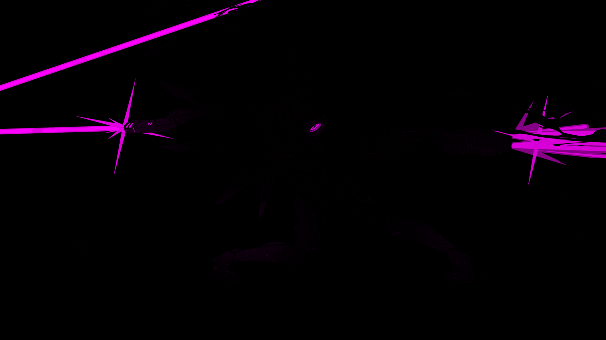

# imgfx-cli
## Command-line front-end for my crate imgfx.

Provides configurable low-level operations (arithmetic, logical, bitwise) and high-level operations (bloom, blending modes, pixel sorting) for images.

Functions:

    add, sub, mult, div
    bitshift left | right
    and, or, xor (and their complements with -n flag)
    screen, overlay, average
    bloom

All functions support operand reordering, allowing precise control over how the image's color channels are processed. Operand reordering lets you redefine how the source image's R, G, and B channels are mapped during the operation.

Each function accepts an image::DynamicImage and returns an image::RgbaImage.

## Installation

To install `imgfx-cli`, clone the repository and build it with `cargo`:

```bash
git clone https://github.com/Echinoidea/imgfx-cli.git imgfx-cli 
cd imgfx-cli 
cargo build --release
```

## Usage
```
Arithmetic, logical, bitwise, filtering, and higher level operations for images.

Usage: imgfx [OPTIONS] <COMMAND>

Commands:
  or       
  and      
  xor      
  left     
  right    
  add      
  sub      
  mult     
  div      
  avg      
  screen   
  overlay  
  bloom    
  help     Print this message or the help of the given subcommand(s)

Options:
  -i, --input <INPUT>          path/to/input/image
      --output <OUTPUT>        path/to/output/image [default: .]
      --lhs <LHS>...           Specify the left hand side operands for the function. E.g. --lhs b g r
      --rhs <RHS>...           Specify the right hand side operands for the function. E.g. --rhs b r b
  -b, --bit-shift <BIT_SHIFT>  If function is 'left' or 'right', how many bits to shift by
  -n, --negate                 Negate the logical operator
  -h, --help                   Print help
  -V, --version                Print version
```

## Examples
```imgfx -i samurai-jack.jpg left 2 --lhs r r r | imgfx and ff0000```


```imgfx -i flcl.png left 2 --lhs r r r | imgfx screen f1c5a7```


```imgfx -i ultramurder.png div ff0000 --lhs g g g --rhs b r b```


